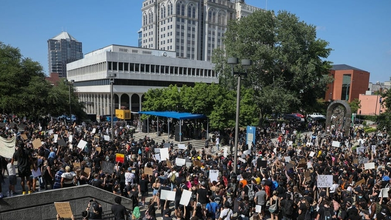
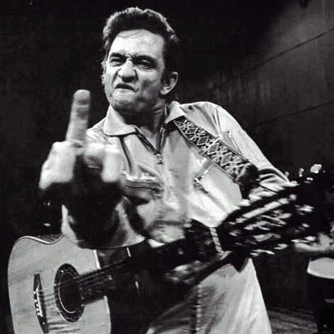
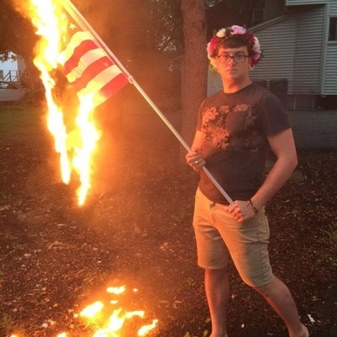
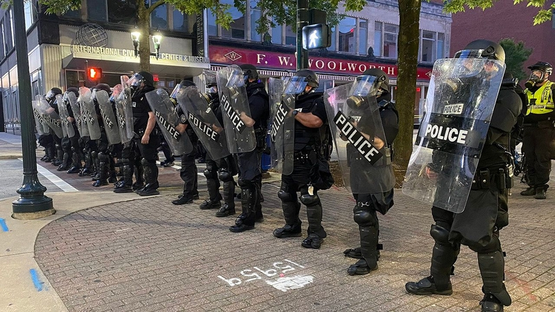

---

title: 'Know Your Rights:'
subtitle: "Demonstrations & Police Encounters"
author: National Lawyers Guild
affiliation: Elon Law School 
date: 11 April 2024

revealjs-url: '.'

output: 
  custom_document:
    path: 'KYR-Demos-11April2024.html'
    pandoc_args: ["-t", "revealjs", "-s"]
    theme: emf-moon 
    slide_level: 3
---

# Disclaimer 

This is a general overview of issues that may arise in political demonstrations and police encounters. The information presented is not offered or intended as legal advice.

# Freedom of Speech & Assembly 

## 1st Amendment 

> Congress shall make no law … abridging the freedom of speech … or the right of the people peaceably to assemble, and to petition the Government for a redress of grievances.

### 1st Amendment: Scope

The 1st Amendment protects against restraints on speech and assembly by _governmen"t action_. 

### 1st Amendment: Effect

Government may not prohibit, restrain, limit, or punish protected 1st Amendment speech or assembly based on the content or subject of the expression, the viewpoint expressed, or the political affiliation or association of the speaker/participants. 

## 1st Amendment: Speech 

Protected speech includes both verbal and non-verbal expression.

### Body Language

### Clothing

### Conduct

## 1st Amendment: Permissible Regulation 

Government may regulate the time, place, and manner of speech or assembly. 

### Time, Place, & Manner Regulations

- Permits for use of certain public places
- Noise ordinances & regulations of sound equipment
- Restrictions on posting signs or flyers
- Prohibitions against blocking pedestrians or traffic

### Time, Place, & Manner Regulations

- Must be content-neutral, both facially and as applied.
- Must be narrowly-tailored to protect a substantial government interest. 
- Must leave open alternative channels of communication to reach the intended audience. 

## 1st Amendment: Public Forum 

1st Amendment protections are strongest in places traditionally open to unrestricted public speech & activity.

### Public Forum

- Sidewalks
- Parks
- Plazas outside government buildings

### Public Forum: Protected Activity 

These activities are generally permitted in a public forum (subject to reasonable time, place, & manner regulation):

*** 

#### Peaceful demonstrations

- Permits may be required for sound amplification. 
- Permits may be required for demonstrations in certain public spaces, such as parks. 

*** 

#### Signs, banners

There may be restrictions on poles or other material that could pose a danger. 

*** 

#### Distribution of literature 

Posting leaflets on walls, lightposts, etc. may be prohibited. 

### Public Forum: Unprotected Activity 

These activities may be restricted or prohibited, and may result in arrest:

- Blocking sidewalks
- Blocking entry to and exit from buildings and public access areas
- Demonstrating or marching in the street without a permit
- Blocking traffic

## 1st Amendment & the Police 

### Interacting with Police

It is generally a good idea to have someone designated to communicate with the police in the event they attempt to restrict 1st Amendment activity, or threaten/carry out arrests, during a demonstration. 

*** 

You may ask the police to explain any restrictions on the activity. 

*** 

You may ask the police why participants have been arrested and where they will be taken following arrest. 

### Interacting with Police

Even if the police do not provide satisfactory answers, or you believe they are infringing on your 1st Amendment rights, arguing with them is typically futile and may lead to being charged with resisting arrest or other criminal offenses. 

# Photographs & Audio-Video Recordings

## Photos & Video Images 

A person who is lawfully present in a public place may photograph or make video recordings of anything and any person in plain view. 

*** 

This includes law enforcement personnel and equipment

### Permission of Those Photographed or Recorded 

Permission of the person being photographed or recorded is not required. 

*** 

Many people do not understand this and may object that photographing or recording them without their permission is a violation of their privacy or other legal rights. 

*** 

It is unlawful for any person to use physical force to stop you from taking photographs or recordings in a public place.

*** 

But be aware that photographs and recordings may be used as evidence against demonstrators in criminal or civil cases. 

## Audio Recordings 

In North Carolina, audio recordings of _private conversations_ only require the consent of _one party_ to the conversation. 

*** 

This may apply to conversations in public places, if there is a _reasonable expectation of privacy_. 

*** 

If the person making the audio recording is a party to the conversation, their consent is sufficient. 

*** 

Audio recordings of conversations with the police acting in their official capacity are not private and do not require permission. 

## Photographs & Recordings on Private Property 

The owner of private property may prohibit or restrict photography and recording on the property. 

*** 

But a property owner may not prohibit you from taking photographs or recordings of the property from a public place. 

## Police Interference with Photography & Recording

The police may not lawfully prohibit you from, or arrest you for, taking photographs or recordings in a public place.

*** 

The police may not lawfully seize your equipment, demand to view your photographs or recordings, or delete your photographs or recordings without a warrant.

*** 

The police may lawfully order you to cease activity, including photography or video recording, if it is interfering with an arrest or other legitimate law enforcement activity.