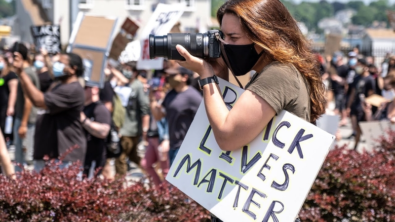

---

title: "Know Your Rights:"
subtitle: Police Encounters
author: National Lawyers Guild
affiliation: Elon Law School 
date: 11 April 2024

revealjs-url: '.'

output: 
  custom_document:
    path: 'KYR-Demos.html'
    pandoc_args: ["-t", "revealjs", "-s"]
    theme: emf-moon 
    slide_level: 4
---

# Disclaimer 

This is a general overview of issues that may arise in political demonstrations. The information presented is not offered or intended as legal advice.

# Freedom of Speech & Assembly 

## 1st Amendment 

> Congress shall make no law … abridging the freedom of speech … or the right of the people peaceably to assemble, and to petition the Government for a redress of grievances.

### 1st Amendment: Scope

The 1st Amendment protects against restraints on speech and assembly by _government action_. 

### 1st Amendment: Effect

Government may not prohibit, restrain, limit, or punish protected 1st Amendment speech or assembly based on the content or subject of the expression, the viewpoint expressed, or the political affiliation or association of the speaker/participants. 

## 1st Amendment: Speech 

Protected speech includes both verbal and non-verbal expression.

### Body Language

{fig-align="center"}

### Clothing

### Conduct

## 1st Amendment: Public Forum 

1st Amendment protections are strongest in places traditionally open to unrestricted public speech & activity.

### Public Forum

- Sidewalks
- Parks
- Plazas outside government buildings

## Permissible Regulation 

Government may regulate the time, place, and manner of speech or assembly. 

### Time, Place, & Manner Regulations: Rules 

- Must be content-neutral, both facially and as applied.
- Must be narrowly-tailored to protect a substantial government interest. 
- Must leave open alternative channels of communication to reach the intended audience. 

### Time, Place, & Manner Regulations: Examples

- Permit requirements
- Noise ordinances & regulations of sound equipment
- Restrictions on posting signs or flyers
- Prohibitions against blocking pedestrians or traffic

## Prior Restraints

### Content-Neutral Prior Restraints

BLM group marches in downtown Winston. The police shut down the parade because the group did not apply for a permit. 

_Does this violate the 1st Amendment?_

### Content-Neutral Prior Restraints: Rule

_Content-neutral_ prior restraints are permissible so long as they are 

a. justified by the noncommunicative impact of the speech, and 
b. the scheme does not provide unfettered discretion to the decisionmaker as to whether the speech is permitted.

### Content-Based Prior Restraints

BLM group applies for a permit to march in downtown Winston. The city denies the request because of the controversial nature of the BLM’s speech. 

_Does this violate the 1st Amendment?_

### Content-Based Prior Restraints: Rule

_Content-based_ prior restraints violate the 1st Amendment. 

### Permit Requirements

Ordinance: permit applicants have to pay not more than $1000 per day, and the county administrator is empowered to “adjust the amount to meet the expense” based on the “maintenance of public order in the matter licensed.”

#### Permit Requirements: Rule

_Forsyth County of Georgia v Nationalist Movement_ (1992)

The ordinance violates the 1st Amendment.

- Permit requirements can be imposed so long as they do not “delegate overly broad licensing discretion to a government official,” and are “not based on the content of the message.”
- Here, “the decision how much to charge—or even whether to charge at all—is left to the whim of the administrator.”
- There are “no articulated standards” or “objective factors” on which the administrator is instructed to rely, or a requirement to “provide an explanation for the decision,” and the decision is not subject to review on appeal.
- “The ordinance often requires that the fee be based on the content of the speech.”

#### Permit Requirements--Public Forum 

Anti-Ukraine War group meets up for a protest in publicly owned downtown park. Members are arrested for trespassing for not having a permit.

#### Permit Requirements--Public Forum: Rule 

Generally, protesting in “public forums” such as sidewalks and parks is permissible without a permit, and cannot be restricted based on the protest’s message.

### Literature Distribution

Ordinance bars the distribution of literature without a permit in advance due to the government interest in preventing littering.

#### Literature Distribution: Rule 

_Schneider v. New Jersey_ (1939): The ordinance violates the 1st Amendment. 

The government interest in keeping the streets clean is insufficient to justify prohibiting defendants from passing out First Amendment-protected literature.

### Interfering with Traffic

Anti-Ukraine War group meets up for a protest on the street. They march on the highway and are arrested for interfering with traffic.

#### Interfering with Traffic: Rule

Generally, restrictions on protests for non-content-related reasons are permissible when those protests cause interference with the government’s purposes for the property on which the protest is taking place. Examples in this context would be traffic control or public safety.

### Location-Based Restrictions

Anti-Gaza War protesters solicit for donations for Palestinian hospitals in the medians on Battleground Avenue. One protester was hit by a driver, and the city of Greensboro has banned all pedestrians from the Battleground medians.

#### Location-Based Restrictions: Rule 

Generally, restrictions on protests for non-content-related reasons are permissible when those protests cause interference with the government’s purposes for the property on which the protest is taking place. Examples in this context would be traffic control or public safety.

# Photographs & Audio-Video Recordings

## Photos & Video Images 

A person who is lawfully present in a public place may photograph or make video recordings of anything and any person in plain view. 

- Permission of persons being photographed or video-recorded is not required

- This includes law enforcement personnel and equipment

## Audio Recordings 

In North Carolina, audio recordings of _private conversations_ only require the consent of _one party_ to the conversation. 

- This may apply to conversations in public places, if there is a _reasonable expectation of privacy_. 

- If the person making the audio recording is a party to the conversation, their consent is sufficient. 

- Audio recordings of conversations with the police acting in their official capacity are not private and do not require permission. 

## Police Interference with Photography & Recording

The police may not lawfully prohibit you from, or arrest you for, taking photographs or recordings in a public place.

- The police may not lawfully seize your equipment, demand to view your photographs or recordings, or delete your photographs or recordings without a warrant.

- The police may lawfully order you to cease activity, including photography or video recording, if it is interfering with an arrest or other legitimate law enforcement activity.

## Photographs & Recordings on Private Property 

The owner of private property may prohibit or restrict photography and recording on the property. 

- But a property owner may not prohibit you from taking photographs or recordings of the property from a public place. 