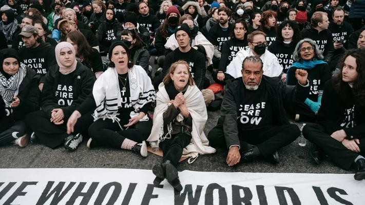

## Prior Restraints

### Content-Neutral Prior Restraints

BLM group marches in downtown Winston. The police shut down the parade because the group did not apply for a permit. 

_Does this violate the 1st Amendment?_

### Content-Neutral Prior Restraints: Rule

_Content-neutral_ prior restraints are permissible so long as they are a) justified by the noncommunicative impact of the speech, and b) the scheme does not provide unfettered discretion to the decisionmaker as to whether the speech is permitted.

### Content-Based Prior Restraints

BLM group applies for a permit to march in downtown Winston. The city denies the request because of the controversial nature of the BLM’s speech. 

_Does this violate the 1st Amendment?_

### Content-Based Prior Restraints: Rule

_Content-based_ prior restraints violate the 1st Amendment. 

### Permit Requirements

Ordinance: permit applicants have to pay not more than $1000 per day, and the county administrator is empowered to “adjust the amount to meet the expense” based on the “maintenance of public order in the matter licensed.”

### Permit Requirements: Rule

_Forsyth County of Georgia v Nationalist Movement_ (1992)

The ordinance violates the 1st Amendment.

- Permit requirements can be imposed so long as they do not “delegate overly broad licensing discretion to a government official,” and are “not based on the content of the message.”
- Here, “the decision how much to charge—or even whether to charge at all—is left to the whim of the administrator.”
- There are “no articulated standards” or “objective factors” on which the administrator is instructed to rely, or a requirement to “provide an explanation for the decision,” and the decision is not subject to review on appeal.
- “The ordinance often requires that the fee be based on the content of the speech.”

### Permit Requirements--Public Forum 

Anti-Ukraine War group meets up for a protest in publicly owned downtown park. Members are arrested for trespassing for not having a permit.

### Permit Requirements--Public Forum: Rule 

Generally, protesting in “public forums” such as sidewalks and parks is permissible without a permit, and cannot be restricted based on the protest’s message.

### Literature Distribution

Ordinance bars the distribution of literature without a permit in advance due to the government interest in preventing littering.

### Literature Distribution: Rule 

_Schneider v. New Jersey_ (1939): The ordinance violates the 1st Amendment. 

The government interest in keeping the streets clean is insufficient to justify prohibiting defendants from passing out First Amendment-protected literature.

### Interfering with Traffic

Anti-Ukraine War group meets up for a protest on the street. They march on the highway and are arrested for interfering with traffic.

### Interfering with Traffic: Rule

Generally, restrictions on protests for non-content-related reasons are permissible when those protests cause interference with the government’s purposes for the property on which the protest is taking place. Examples in this context would be traffic control or public safety.

### Content-Neutral Restrictions

Anti-Gaza War protesters solicit for donations for Palestinian hospitals in the medians on Battleground Avenue. One protester was hit by a driver, and the city of Greensboro has banned all pedestrians from the Battleground medians.

### Content-Neutral Restrictions: Rule 

Generally, restrictions on protests for non-content-related reasons are permissible when those protests cause interference with the government’s purposes for the property on which the protest is taking place. Examples in this context would be traffic control or public safety.

